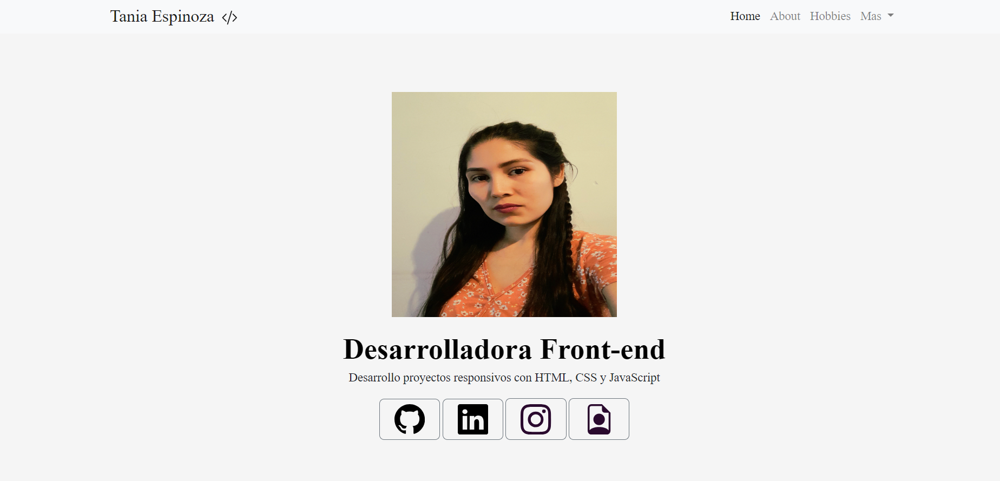

# Portafolio

Este proyecto fue creado durante el bootcamp Technolochicas PRO, es una pagina responsiva. 
El proposito de la creacion de este sitio web es mostrar el portafolio de proyectos de la desarrolladora y su experiencoa alrededor del area.
Incluye las lecciones: sobre mi,proyectos, experiencia.

Incluye recursos multimedia

<a href="" target="_blank"> **Visitalo ahora** 🚀</a>

# Secciones (capturas de pantalla)
sobre mi:

# Tecnologías 

## 📬 contacto

Si estas interesad@ en compartir o conectar para algun proyecto U oportunidad laboral, puedes contactarme.

<a href="https://www.linkedin.com/in/estephania-espinoza-172470228/"> </img> </a>
 
 © 2023 Tania Espinoza (Programa Technolochicas PRO)
